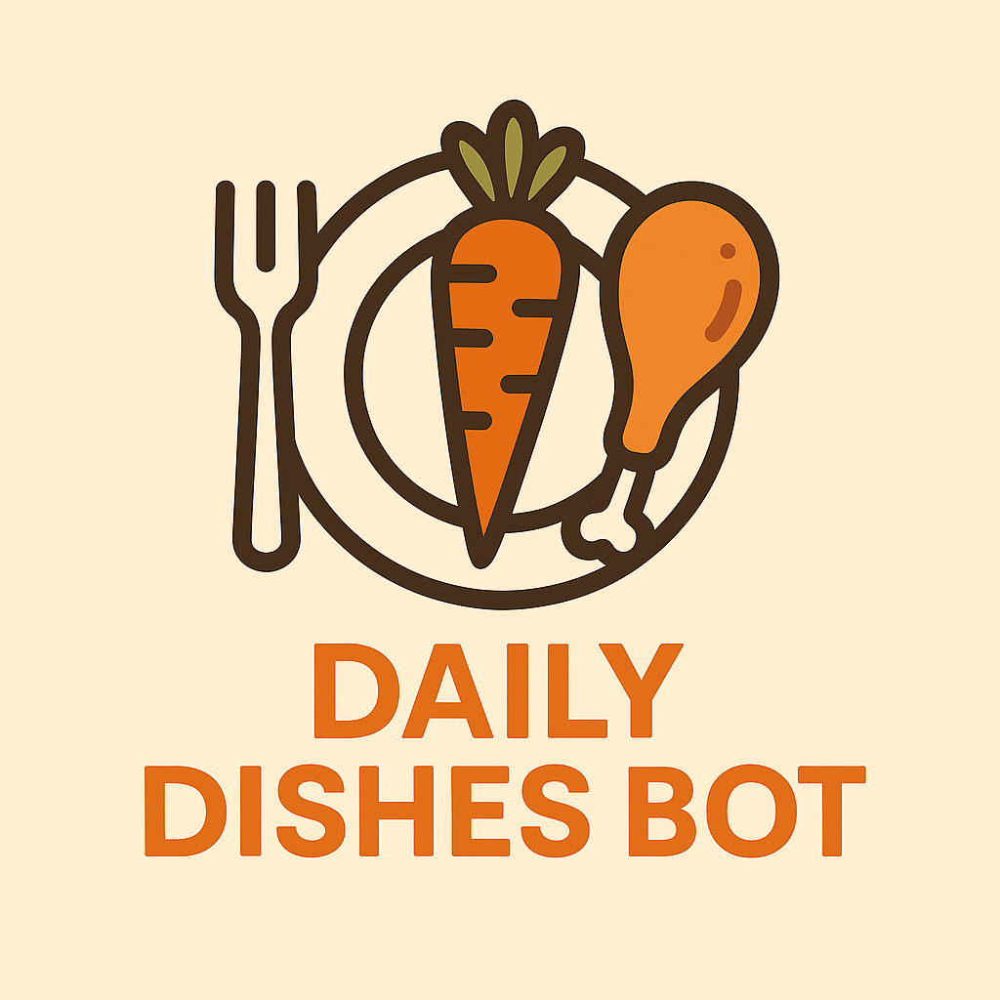

# DailyDishesBot



Telegram-бот и веб-админка для планирования рациона. Позволяет пользователю получать рецепты, сохранять любимые блюда и оформлять подписку для безлимитного доступа. Администратор управляет рецептами через Django Admin.

## Возможности

- Получение случайных рецептов
- Сохранение любимых рецептов
- Ограничение бесплатного доступа к рецептам
- Оформление подписки для снятия ограничений
- Удобная админка для управления рецептами

## Структура проекта

```
DailyDishesBot/
├── Bot/
│   ├── __init__.py
│   ├── .env               # Настройки бота
│   ├── handlers.py        # Логика обработки кнопок
│   ├── keyboards.py       # Клавиатуры для бота
│   ├── run.py             # Точка входа для бота
├── FoodBot/
│   ├── __init__.py
│   ├── admin.py           # Админ-панель Django
│   ├── asgi.py
│   ├── models.py          # Модели Django
│   ├── settings.py        # Настройки Django
│   ├── urls.py
│   ├── wsgi.py
│   └── migrations/
│       ├── __init__.py
│       └── ... миграции базы данных ...
├── media/
│   └── recipes/           # Изображения рецептов
├── db.sqlite3             # БД Django
├── logo_big.png           # Логотип
├── scheme.png             # Схема работы бота
├── Dockerfile             # Инструкция Docker
├── docker-compose.yml     # Docker-оркестрация
├── requirements.txt       # Python-зависимости
└── manage.py              # Django-утилита
```

## Требования

- Python 3.12
- Django 5.2
- Docker 24+
- Docker Compose Plugin 2.24+
- python-telegram-bot 13.15


## Установка и запуск через Docker

1. Клонируйте репозиторий:

```bash
git clone https://github.com/PracticeMakesPerfect73/Food_plan.git
cd Food_plan
```

2. Создайте телеграм-бота и получите токен:
    - Откройте Telegram и найдите бота по имени: `@BotFather`.
    - Напишите ему команду `/start` (если ранее не общались).
    - Отправьте `/newbot` для создания нового бота.
    - BotFather попросит ввести имя бота:
        - Пример: `My SSHAutomation Bot`
    - Затем попросит ввести юзернейм бота (должен заканчиваться на `bot`):
        - Пример: `MySSHAutomationBot`
    - После успешного создания BotFather вернёт вам токен вашего бота. Он будет в формате:
        - `123456789:ABC-DEF1234ghIkl-zyx57W2v1u123ew11`
        - Этот токен необходимо сохранить в `.env` файле (см. далее).

3. Создайте файл `.env` по примеру ниже:

```env
TG_TOKEN=ваш_токен_бота
DAILY_FREE_LIMIT=5
```

4. Соберите и запустите проект через Docker Compose:

```bash
docker compose up -d --build
```

5. Выполните миграции (если нужно обновить базу данных):

```bash
docker compose exec web python manage.py migrate
```

6. Создайте суперпользователя для доступа в Django Admin:

```bash
docker compose exec web python manage.py createsuperuser
```


## Доступ к интерфейсам

- **Веб-админка:**

  Перейдите по адресу:

  ```
  http://<IP_или_домен>:8000/admin/
  ```

  Войдите, используя данные суперпользователя.

- **Telegram-Бот:**

  Запустите бота в Telegram и начните взаимодействие через команду `/start`.


## Лицензия

Проект предоставляется "как есть" без каких-либо гарантий.


## Авторы

- [Alexey](https://github.com/PracticeMakesPerfect73)
- [AlexKlos](https://github.com/AlexKlos)
- [Aleksashka301](https://github.com/Aleksashka301)

